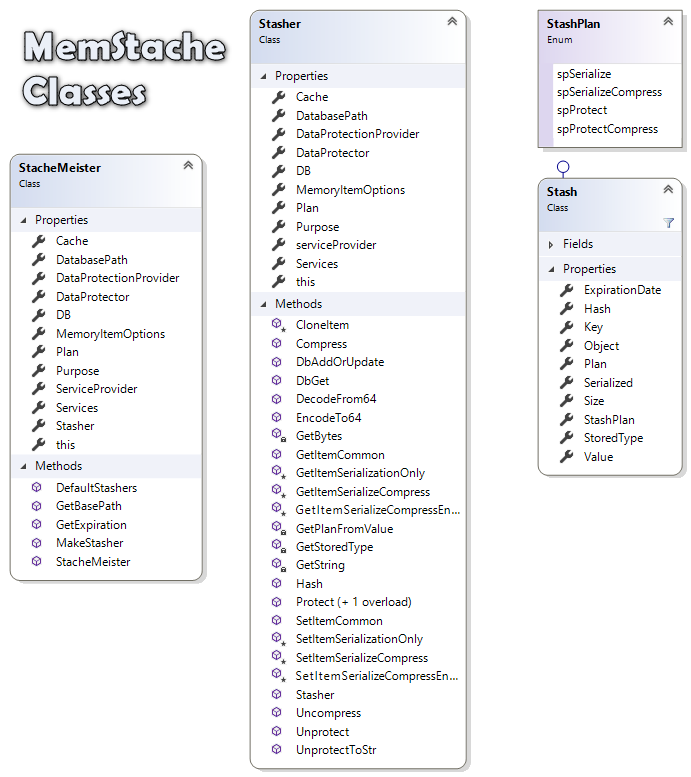
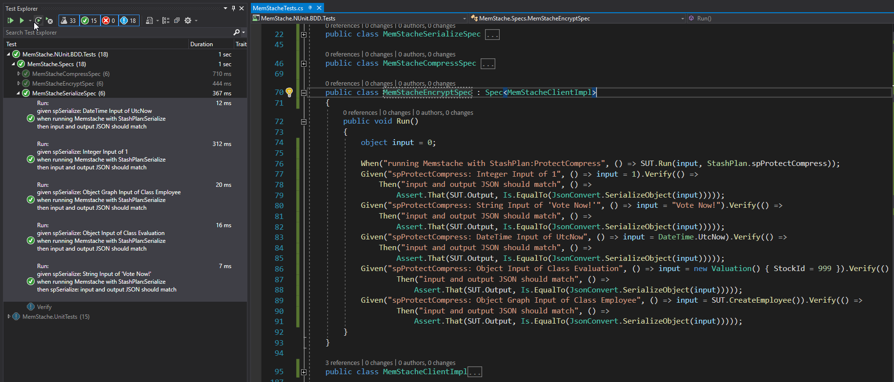

# MemStache
A Flexible, Powerful Cache Library with these features

		- In-Memory Resiliency (memory management)
		- Serialization
		- Data Persistence
		- Instant Data Availability 
		- Security In-Memory (Encrypted Memory)
		- Security On-Disk (Encrypted file on disk)
		- All Code written in .NET Standard 2.
		- Leverage .NET Standard DI Framework.
		- A Small Intuitive Developer API

Nuget Package is available: https://www.nuget.org/packages/MemStache



MemStache is designed to be used exactly the way the original Asp.NET Memory Cache was used.

Example -
    Original Asp.Net code: 
```
        MemoryCache cache = MemoryCache.Default;
        cache[EmployeeId] = CreateEmployee(EmployeeId, name, dob);
        Employee empResult = (Employee)cache[EmployeeId];
```
    MemStache equivalent: 
```
        StacheMeister cache = new StacheMeister("memstache.demo", "FileName", "Password", StashPlan.spProtectCompress);
        cache[EmployeeId] = CreateEmployee(EmployeeId, name, dob);
        Employee empResult = cache[EmployeeId] as Employee;
```
Same code semantics, but Memstache utilizes:

		- the NewtonSoft library to serialize the data, 
		- built-in data-compression
		- the .NET Standard 2 ASPNET.Core.DataProtection API to encrypt the data in-memory
		- Microsoft.Extensions.Caching.Memory API to provide a memory-managed in-memory Cache
		- the LiteDB library to provide an encrypted on-disk Cache
		- optional use of compression and/or encryption.        

I would like to acknowledge James Montemagno and Frank Krueger of Merge/Conflict fame and their podcast on Monkey Cache for giving me the inspiration to write my own cache library:
https://www.mergeconflict.fm/76

I also based my implementation of LiteDB integration on the one in MonkeyCache!  Thanks!

I have written this library to specifically be used in Xamarin Forms apps, but any program using .NET Standard 2 can use it.

Best way to learn how to use this library is to look at the unit tests.

A note on serialization: Anything that can be serialized by the NewtonSoft libary should be assignable to the cache.  When in doubt, write a unit test, first, to prove that NewtonSoft can serialize your object.


**BDD Tests**

10/22/2019: Just added BDD Tests via SpecEasy https://github.com/speceasy/speceasy

This should make is easier for developers visualize how to use MemStache. Here is a screenshot




Enjoy
